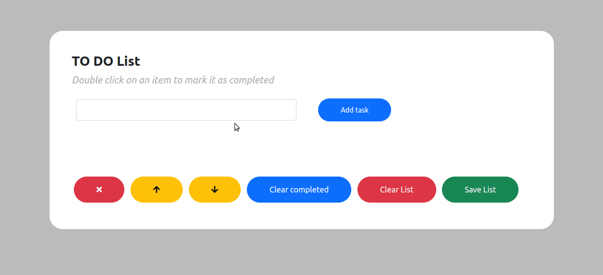

# About the project / *Sobre o projeto*

This project is a list of tasks using Javascript and Local Storage. User is able to add tasks, move up or down, mark as completed and keep saved when reloading the page. It is also possible to delete the task individually as well as the entire list.

*Esse projeto é uma lista de tarefas utilizando Javascript e Local Storage. O usuário é capaz de adicionar tarefas, movimentar para cima ou para baixo, marcar como completa e manter salvo ao recarregar a página. Também é possível apagar a tarefa individualmente assim como toda a lista.*

---
# Skills / *Habilidades*

 - HTML
 - CSS
 - Javascript
 - Local Storage

---
# Layout

---
# Deployment / *Implantação*

See it in action/ **Veja em ação**: [https://kelsonbatista.github.io/project-todo-list/](https://kelsonbatista.github.io/project-todo-list/)
